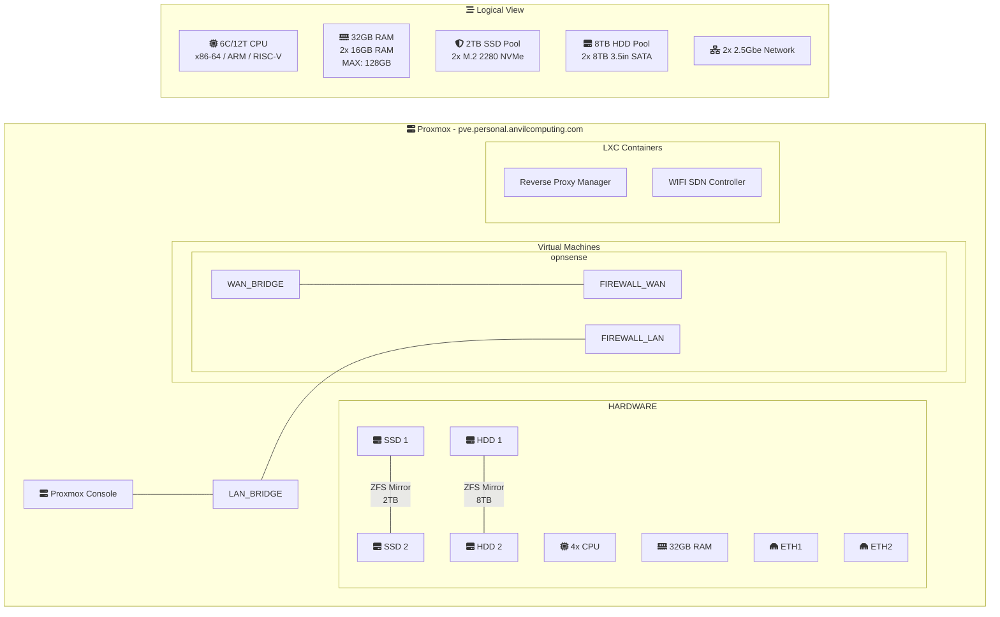

```mermaid
flowchart LR
    
    subgraph PROXMOX [fa:fa-server Proxmox - pve.personal.anvilcomputing.com]
        direction LR
        WAN_BRIDGE
        LAN_BRIDGE
        subgraph HARDWARE
            SSD_1[fa:fa-hdd SSD 1] ---|"ZFS Mirror
            2TB"| SSD_2[fa:fa-hdd SSD 2]
            HDD_1[fa:fa-hdd HDD 1] ---|"ZFS Mirror
                8TB"| HDD_2[fa:fa-hdd HDD 2]
            PROXMOX_CPU[fa:fa-microchip 4x CPU]
            PROXMOX_RAM[fa:fa-memory 32GB RAM]
            ETH1[fa:fa-ethernet ETH1]
            ETH2[fa:fa-ethernet ETH2]
        end
        PROXMOX_CONSOLE[fa:fa-server Proxmox Console] --- LAN_BRIDGE
        subgraph VMs [Virtual Machines]
            subgraph OPNsense [opnsense]
                FIREWALL_WAN
                WAN_BRIDGE
                FIREWALL_LAN
            end
        end
        subgraph LXC_CONTAINERS[LXC Containers]
            REVERSE_PROXY_MANAGER[Reverse Proxy Manager]
            WIFI_SDN[WIFI SDN Controller]
        end
        WAN_BRIDGE --- FIREWALL_WAN
        LAN_BRIDGE --- FIREWALL_LAN
    end

    subgraph LOGICAL_VIEW [fa:fa-stream Logical View]
        CPU["fa:fa-microchip 6C/12T CPU
            x86-64 / ARM / RISC-V"]
        RAM["fa:fa-memory 32GB RAM
            2x 16GB RAM
            MAX: 128GB"]
        SSD_POOL["fa:fa-shield-alt 2TB SSD Pool
            2x M.2 2280 NVMe"]
        HDD_POOL["fa:fa-hdd 8TB HDD Pool
            2x 8TB 3.5in SATA"]
        NET[fa:fa-network-wired 2x 2.5Gbe Network]
    end
```
